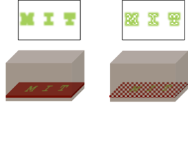
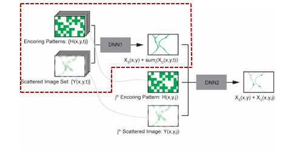
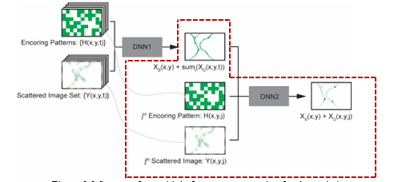
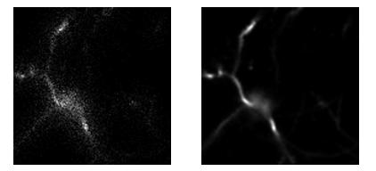

# Computational Functional Imaging in Deep Tissue
**final-year-project(Collaborative project with Harvard University, Cambridge, USA)**

## ABSTRACT
**Keywords**: Fluorescence imaging, dynamic images, two-photon imaging, temporal
focusing
Capturing fast biological dynamic events through scattering biological tissue for a large
imaging field of view (FoV) is a challenging task. State of the art two-photon point
scanning microscopy, which is the workhorse in deep tissue imaging experiments, is
speed limited; usually, FoV is sacrificed in the favor of temporal-resolution or vice
versa. For rapid wide-field two-photon imaging previously demonstrated a large FoV
two-photon microscopy technique, called DEEP-TFM, based on temporal focusing and
coded illumination.
However, to reconstruct one large-FoV image frame, multiple coded illuminations are
needed, restricting temporal resolution. However, in many applications, temporal
dynamics appear as spatially constraint signal, on a slow varying (near-static)
background signal. In this work, we demonstrate a deep neural network (DNN)
framework to separate the dynamic signal from the static signal at the true imaging
framerate. We first estimate the sum of the static and dynamic images using a deep
neural network. Then we feed this output, along with one illumination code and its
corresponding scattered image, to a second-deep neural network to estimate the current
dynamic image.
We demonstrate our framework on simulated images and experimental images.
One Paragraph of project description goes here

## INTRODUCTION

### Introduction to two-photon imaging

Fluorescence microscopy is an imaging technique where the whole sample is illuminated
with light of a specific wavelength, exciting fluorescent molecules within it.

▪ Dynamic Imaging: Any diagnostic image that varies with time. Also called realtime imaging 
▪ Static Imaging: any diagnostic image that is fixed or frozen in time.

Initially, one photon is used for exciting fluorescent molecules. But the emission light is
focused along the entire illuminated cone, not just at the focus. Moreover, the following
constraints occur with one photon (conventional) fluorescence imaging when observing
thick specimens.

▪ Physical limitations: Objective lens working distance is limited 
▪ Tissue penetration depth: due to absorption and scattering of the emission light

To overcome this constraint two-photon imaging is introduced. ICapt can restrict excitation
to a tiny focal volume which allows the visualization of living tissue at depths unachievable
with one photon fluorescence microscopy.
There are several microscopes that use this two photon imaging technique.
When using point scanning emission photons from the focal point scattered or not being
collected by a point detector and assign to a single pixel of the image. Hence this method
is very slow. Moreover, Point scanning two-photon imaging is not fast enough to see large
regions in the brain at functional speed. 

The wide-field two photon microscopy is a good alternative for this. In it a short-pulse
laser beam is scattered by a grating. To maintain the widefield imaging the emission light
from the focal plane is typically recorded by a camera. This may assign incorrect pixels on
the detector, resulting in degradation of both resolution and signal to noise. Although
temporal focusing light can deliver light through scattering media, collecting light back is
not much efficient in this modality due to the scattering. Hence Temporal Focusing
Microscope (TFM) shows background haze at shallower image planes.
Escobet et al [1] have proposed a single pixel detector while modulating excitation light in
the imaged field of view by projecting a set of patterns. The modulated images are then
recorded using the microscope.

As they use single-pixel detection the acquisition time is quite high and depends on the
field of view. They require the same number of illumination patterns as the number of pixels
in the imaged field of view. Thus, no evident speed up over Point Scanning Two-Photon
Microscopy (PSTPM) was demonstrated. 

In Professor Peter So’s group in Massachusetts Institute of Technology (MIT), they have
developed a computational imaging technique to see a large field of views with two-photon
microscopy. They are also using a set of patterns, but the emission light is detected by a
camera. The camera is used to obtain a large field of view at the detector.
In practice, TFM images are minimally affected by scattering at or near the surface; as the
imaging depth increases, scattering gradually degrades only the high-frequency
information in the images.
DEEP-TFM combines the information about the excitation patterns with the acquired
images, to computationally reconstruct a de-scattered image.

Experimentally, to de-scatter a single FoV, multiple patterned excitations (and images) are
needed; the number depends on the loss of high-frequency information due to scattering,
and hence on the imaging depth.

That group has developed a mathematical model for reconstructing images using the
patterns and the acquired images in each image plane. However, the existing model is timeconsuming and not suitable for dynamic image reconstruction.
Objectives of our project:

1. Simulation of a synthetic dataset.
2. One frame reconstruction for static images.
3. Multiple image frame reconstruction for dynamic images.

### Main Novelty of the project:

DEEP-TFM is a novel computational wide-field technology for deep tissue multiphoton
microscopy. DEEP-TFM can resolve images with similar quality to point scanning twophoton microscopy for static images with the existing reconstruction algorithm. That
approach of DEEP-TFM is FoV independent. Our goal is the obtain multiple frames for
dynamic images obtained from DEEP-TFM. This is a novel concept as these microscopes
are mainly used for capturing static images. For living tissues, it is hard to obtain a static
image. By implementing a model which can reconstruct multiple frames for dynamic
images, it enables to capture fast biological dynamic events through scattering biological
tissue for a large imaging FoV. 

## METHODOLOGY

Our approach can be mainly divided into three parts as we mentioned in the objectives.

1. Simulation of synthetic dataset
2. Developing a model for one frame reconstruction for the static images.
3. Developing a model for multi-frame reconstruction for the dynamic images.

When we consider our first objective, we have to create a synthetic dataset similar to the
images obtained using DEEP-TFM. The synthesis approach is used as it is not always
possible to access DEEP-TFM to obtain images. Moreover, PSTPM provides more reliable
static images without scattering and we have enough data acquired using PSTPM which is
enough for us to create a reliable and accurate dataset. Because of that initially, we convert
those images which are obtained from point scanning two-photon microscopy to images
similar to the what we can obtain using the DEEP-TFM. So for that, we have to design and
implement a simulator. The process which happens inside the simulator is, input the image

obtained using PSTPM and obtain element-wise multiplication of that image with the
excitation patterns, as shown in above figure.
Convolve the result with the scattering point spread function. For every excitation pattern,
we obtain one scattering image. The number of images in the scattered image stack is equal
to the number of excitation pattern, which we used to multiply with the image, obtained
from PSTPM.

As the second objective, we are going to create a model for one frame reconstruction for
static images. For this model, we used the synthetic data set which we obtained using the
forward model, as the input for this model. Through this model, we obtain one image as
output which contains both static and dynamic parts. It means by using this model it gives
sum of all the images which we give as input. (If the input dataset contains a series of

dynamic images the output contains both static and dynamic parts and if not only static
images output gives only the static image without dynamic part.)
Eg: All the images were taken in 10s with a frame rate of 100𝑠 are 1000. The output is
the sum of the all 1000 images acquired at different 1000 time instances with different
patterns.

As the third objective, we create multiple frames for the dynamic images. It means through
this model are able to filter the dynamic part from the output image which we obtain from
the 2nd task. Through this model, we can reconstruct an image taken at a certain time
instance, which varies with the time(dynamic).
Eg: From the second task we obtain the sum of 1000 either static or dynamic. Using that
we obtain a frame taken at the 𝑗th time instance(in the 0-1000 time range), which contain
the sum of both static and dynamic parts. 

## Conclusion Drawn of the Initial Results

Initially, we were able to generate some images using the PSTPM images by applying the
forward model, we discussed in the methodology.
It is possible to generate images using the forward model and we could generate many cases
from an image stack obtained using PSTPM. We have used 16 patterns initially.
For 16 patterns we could obtain 16 scattered images. A single image obtained for a single
pattern and its ground truth is shown in the figure. 

### References

1. A. . Escobet-Montalbán, R. . Spesyvtsev, M. . Chen, W. A. Saber, M. R. Andrews, C. S. Herrington, M. . Mazilu and K. . Dholakia, "Wide-field multiphoton imaging through scattering media without correction," Science Advances, vol. 4, no. 10, p. , 2018.

2. Y. . Wang, B. . Yu, L. . Wang, C. . Zu, D. S. Lalush, W. . Lin, X. . Wu, J. . Zhou, J. .
Zhou, D. . Shen, D. . Shen, L. . Zhou and L. . Zhou, "3D conditional generative
adversarial networks for high-quality PET image estimation at low dose,"
NeuroImage, vol. 174, no. , pp. 550-562, 2018.

3. X. . Yi, E. . Walia and P. . Babyn, "Generative Adversarial Network in Medical
Imaging: A Review.," arXiv: Computer Vision and Pattern Recognition, vol. , no. , p.
, 2018.

4. G. W. Taylor, R. . Fergus, Y. . LeCun and C. . Bregler, "Convolutional learning of
spatio-temporal features," , 2010. [Online]. Available:
http://yann.lecun.com/exdb/publis/pdf/taylor-eccv-10.pdf. [Accessed 4 4 2019].

5. Y. . Rivenson, Z. . Göröcs, H. . Gunaydin, Y. . Zhang, H. . Wang and A. . Ozcan,
"Deep learning microscopy," arXiv: Learning, vol. 4, no. 11, pp. 1437-1443, 2017.

6. M. . Weigert, U. . Schmidt, T. . Boothe, A. . Müller, A. . Dibrov, A. . Jain, B. . Wilhelm,
D. . Schmidt, C. . Broaddus, S. . Culley, S. . Culley, M. . Rocha-Martins, F. . SegoviaMiranda, C. . Norden, R. . Henriques, R. . Henriques, M. . Zerial, M. . Solimena, J.
C. Rink, P. . Tomancak, L. . Royer, F. . Jug, E. W. Myers and E. W. Myers, "Contentaware image restoration: pushing the limits of fluorescence microscopy," Nature
Methods, vol. 15, no. 12, pp. 1090-1097, 2018.

7. J. M. Wolterink, T. Leiner, M. A. Viergever and I. Isgum, "Generative Adversarial
Networks for Noise Reduction in Low-Dose CT," IEEE transactions on medical
imaging, 2017.

8. Y. Wang, B. Yu, L. Wang, C. Zu, D. S. Lalush, W. Lin, X. Wu, J. Zhou, D. Shen and
L. Zhou, "3D conditional generative adversarial networks for high-quality PET image
estimation at low dose," NeuroImage, 2018.

9. K. Svoboda and R. Yasuda, Principles of Two-Photon Excitation Microscopy and Its
Applications to Neuroscience, 2006.

10. C. L. Smith, "Basic confocal microscopy," Current Protocols in Neuroscience, 2011.

11. J. Schlemper, J. Caballero, J. V. Hajnal, A. N. Price and D. Rueckert, "A Deep
Cascade of Convolutional Neural Networks for Dynamic MR Image Reconstruction,"
IEEE Transactions on Medical Imaging, 2018.

12. C. J. Rowlands, O. T. Bruns, M. G. Bawendi and P. T. C. So, "Objective, comparative
assessment of the penetration depth of temporal-focusing microscopy for imaging
various organs," Journal of Biomedical Optics, 2015.

13. E. Papagiakoumou, V. de Sars, V. Emiliani and D. Oron, "Temporal focusing with
spatially modulated excitation," Optics Express, 2009.

14. D. Oron and Y. Silberberg, "Temporal focusing microscopy," Cold Spring Harbor
Protocols, 2015. 

15. W. L. Johnson and A. F. Straight, "Fluorescent protein applications in microscopy,"
in Methods in Cell Biology, 2013.

16. F. Helmchen and W. Denk, Deep tissue two-photon microscopy, 2005.

17. J. Friedrich, W. Yang, D. Soudry, Y. Mu, M. B. Ahrens, R. Yuste, D. S. Peterka and
L. Paninski, "Multi-scale approaches for high-speed imaging and analysis of large
neural populations," PLoS computational biology, 2017.

18. M. F. Duarte, M. A. Davenport, D. Takhar, J. N. Laska, T. Sun, K. F. Kelly and R. G.
Baraniuk, "Single-pixel imaging via compressive sampling," IEEE Signal Processing
Magazine, 2008.

19. F. Dietrichson, E. Smistad, A. Østvik and L. Lovstakken, "Ultrasound Speckle
Reduction Using Generative Adversial Networks," in IEEE International Ultrasonics
Symposium, IUS, 2018.

20. W. Becker, "Fluorescence lifetime imaging - techniques and applications," Journal of
Microscopy, 2012. 
